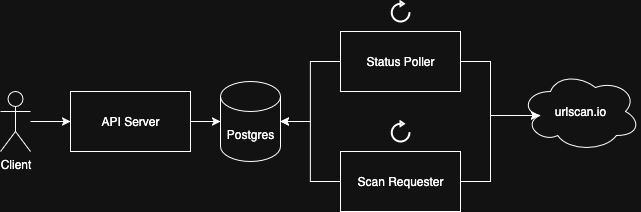

# URL Scan Service

## Overview

The URL Scan Service is a system that allows users to submit, manage, and view the results of scans against URLs for
potential security issues. The service offers an endpoint for clients to create, view, and delete scan requests through
the `/v1/scans` endpoint.

## Development

### Pre-requisites

Before attempting to build and run the server locally, make sure the following tools are set up on your local
development machine.

#### Docker

Docker is used for hosting the containers that the service is composed of. To get started quickly,
install [Docker Desktop](https://docs.docker.com/desktop/), which provides a GUI.

### Building the Service

To build the service and run unit tests, run the following command:

```shell
./mvnw clean install
```

### Running the Service

The service runs as 4 separate containers in Docker:

1. `postgres`: A postgres instance that serves as the database
2. `api-server`: A Spring Boot application that serves as the API server
3. `scan-submitter`: A Spring Boot application that runs a scheduled job for submitting pending scan requests
4. `status-poller`: A Spring Boot application that runs a scheduled job for polling the status of ongoing scan requests

The following containers have port mappings which can be used for localhost access:

* Postgres: http://localhost:5432
* Application: http://localhost:80

In order to run the service, run the following command:

```shell
docker compose up --build
```

### Database Schema Changes

Whenever the project is built, the `create.sql` file under `database/` will be updated with sample SQL statements for
initializing a fresh database.

The `init.sql` file in the `database/sql` folder contains the SQL commands for initializing a Postgres database when the
container is first started in Docker. In order for the changes to be reflected in the database container, the container
must be restarted using:

```shell
docker compose down -v
```

Once the running containers have terminated, run the following command to restart them:

```shell
docker compose up --build
```

## Testing

Confidence in the correctness of the service should be gained mostly through automated testing in the form of unit tests
which run at build time and integration tests which run once the service is running. However, to facilitate development
of new APIs and features, a [Swagger UI](https://swagger.io/tools/swagger-ui/) is exposed which simplifies direct API
access.

### Manual Testing

Once the service is running in Docker, navigate to http://localhost/swagger-ui/index.html to access the Swagger UI.
The UI displays API documentation, as well as domain models used in requests and responses.

The UI can be leveraged to send requests and receive responses by expanding each API endpoint and clicking `Try it out`.

#### Logging Out

To log out, navigate to http://localhost/logout.

#### API Documentation

OpenAPI documentation on the APIs are auto-generated and available from http://localhost/v3/api-docs.

### Unit Testing

Unit tests run at build time and both line and branch coverage is required to be at least 80% in order to pass.

### Integration Testing

Integration tests run against a running service. It ensures the integration points of the service with dependencies (
Postgres database, urlscan.io) are working as expected. The integration tests are maintained in a
separate (to be implemented) [url-scan-service-tests]() repository. Refer to the README of the repository for executing
the tests.

## Authentication

User authentication to the service is done using [Auth0](https://auth0.com/), which allows the creation of new user
accounts for testing.

*Note: Auth0 was chosen over a manual implementation in order to simulate standard authentication and authorization
protocols through the Authorization header of requests*

## Usage

Refer to the [API docs](misc/api-docs.json) for available APIs and relevant schemas. It is recommended that a client be
generated using updated OpenAPI specs and not manually created.

Service-to-service authentication has not yet been implemented, but clients can issue requests to the APIs with a valid
authorization token that is received from Auth0. To initiate a scan on a set of URLs:

### Option 1

1. Submit all desired URLs via `POST /scans`, storing the URL to scan ID mapping
2. Poll the completion status of each URL via `GET /scans/${scanId}` until the status is `DONE` or `FAILED`
3. (to be implemented) Retrieve the scan results in JSON via `GET /scans/${scanId}/results` for processing

### Option 2 (to be implemented)

1. Submit all desired URLs via `POST /scans`
2. URL Scan Service processes changes off of change data capture on the `scan_result` Postgres table and sends a
   notification to your client's message queue when status is updated to `DONE` or `FAILED`
3. Asynchronously listen to messages from the message queue for when a scan has finished scanning or failed
4. Retrieve the scan results in JSON via `GET /scans/${scanId}/results` for processing

## Design



The URL Scan Service is composed of 3 separate components:

* API Server: A REST API service for performing CRUD operations against URL scans
* Scan Requester: A long-running process that asynchronously submits URL scan requests to urlscan.io
* Status Poller: A long-running process that asynchronously polls the status of submitted URL scans for completion

The components are separated because they perform different responsibilities, and as the system scales, are likely scale
differently.

For example:

* In the event that read requests increase disproportionately to write requests, only the API service is required to
  scale to handle the increased load
* In the event that the status poller is to process scan results (which tend to be large), it can scale independently of
  the API server or the scan submitter
* In the event that clients are not sensitive to latency and can wait for an extended time to receive scan result, the
  API server can have more relaxed throttles against clients than what urlscan.io can provide

### API Server

The API Server provides a REST API for CRUD operations against URL scans through the following APIs:

* GET `/v1/scans`: lists historical scan requests with summary information for each scan
* GET `/v1/scans/{scanId}`: retrieves detailed information for a given scan
* POST `/v1/scans`: submits a new scan request
* DELETE `/v1/scans/{scanId}`: deletes an existing scan request

APIs require authentication, which is managed
through [an Auth0 application](https://manage.auth0.com/dashboard/us/dev-bglprge8mcc8yj82/applications/7s16iwyxHFmiZO7CJeRYmaFMTqB7nP4I/settings).
Users are only allowed to view and manage their own scans, but can be returned scan results from a prior scan with
the same parameters if submitted within a given dedupe window (currently 1 hour).

The service exposes a Swagger UI, which can be used to issue requests against endpoints manually. The UI shows all
available endpoints, model types, documentation, and sample request/responses that are used in the APIs.

#### Exception Handling

Exceptions that occur in the API service are modeled as internal exceptions, then translated via a global interceptor
into external exceptions. Once translated, external exceptions will specify the type of the internal exception that
caused the error, and a message (if not sensitive) which provides details on the error.
The following list includes all external status codes and the internal exceptions that are translated into them:

* 404 Not Found
    * ResourceNotFoundException
* 425 Too Early
    * DuplicateRequestException
* 400 Bad Request
    * BadRequestException

Untranslated internal exceptions result in a 500 Internal Server Error to clients without error details.

#### Throttling

Currently, throttling has not been implemented on the API Server. However, it is good practice to implement global and
per-client
throttles against APIs based on the capacity of the server itself and any dependencies (ex: Postgres).

Because the API server does not interact with urlscan.io directly, its throttle limits should be based on the connection
capacity of the server and the throughput of Postgres.

Backpressure, however, is very important in this case to ensure scans are fulfilled in a reasonable time and that the
backlog does not expand indefinitely. For applying backpressure, the depth of scan queue both globally and per-user
should be measured, and throttling should be applied when the backlog gets sufficiently large.

#### Database

Data for the service is persisted in a Postgres database that contains 2 tables:

* `scan`: table that contains entries for individual user scan requests, with a foreign key to the `scan_result` which
  contains details on the scan that was requested
* `scan_result`: table that contains entries for individual scan requests and results that are sent to urlscan.io

Two tables are used in order to separate the handling of user scan requests, and the scans that are actually issued to
urlscan.io. This separation allows for simpler deduplication on the scans that are sent to urlscan.io, which reduces
load against the service.

### Scan Requester

The Scan Requester is an asynchronous worker which runs on a schedule (currently every 10 seconds) to query scan
requests that have not been sent to urlscan.io, and sends them to urlscan.io.

The worker performs the following steps on every run:

1. (To be implemented) Compare current time against throttle reset time
    * If throttle reset time does not exist or if current time is on or after the throttle reset time, continue
    * If current time is before throttle reset time, stop processing
2. Queries the `scan_result` table for a page of scan results with a `SUBMITTED` status sorted in ascending order by
   when the entity was created at, and issues a `POST /scan` request for the URL to urlscan.io
3. Depending on the response from urlscan.io:
    * If request was successful (200 Status Code), save the returned reference ID and result URL and update result
      status to `PROCESSING`
    * If request was throttled (429 Status Code), save the time when the throttle is to reset and terminate processing
      of remaining requests for this run
    * If request was rejected as a client-side error (remaining 4xx), save the returned error details and update result
      status to
      `FAILED`
    * If request acceptance was indeterminate (remaining status codes), do not update the entity and wait to retry on
      the next run
4. Repeat from 2. until there are no more pending results to submit

#### Error Handling

While the above steps outline a general approach to error handling, there are several gaps that still need to be
addressed:

1. Unknown status codes: unknown status codes currently can result in infinite retries, which poses a problem for the
   system especially when multiple scans terminate in this state. There needs to be monitoring on the number of retries
   that occurred in this way, and perhaps a setting to the failed state after a certain number of retries with the
   returned details.
2. Pagination: Currently pagination is implemented using a page offset. Especially because the query is on the status of
   the scan result which can be updated during processing, this will likely lead to scans being missed. The pagination
   scheme needs to be updated to provide a cursor for where to pick the query back up from.

### Status Poller

The Status Poller is an asynchronous worker which runs on a schedule (currently every 10 seconds) to query scan
requests that have been successfully submitted to urlscan.io, and checks if the results are ready.

The worker performs the following steps on every run:

1. (To be implemented) Compare current time against throttle reset time
    * If throttle reset time does not exist or if current time is on or after the throttle reset time, continue
    * If current time is before throttle reset time, stop processing
2. Queries the `scan_result` table for a page of scan results with a `PROCESSING` status sorted in ascending order by
   when the entity was created at, and issues a `GET /results/{scanId}` request for the status of a scan result to
   urlscan.io
3. Depending on the response from urlscan.io:
    * If request was successful (200 Status Code), update result status to `DONE`
    * If request was throttled (429 Status Code), save the time when the throttle is to reset and terminate processing
      of remaining requests for this run
    * If request is still processing (404 Status Code with message `Scan is not finished yet`), do not update the entity
      and retry on the next run
    * If request was rejected as a client-side error (remaining 4xx), save the returned error details and update result
      status to `FAILED`
    * If request acceptance was indeterminate (remaining status codes), do not update the entity and wait to retry on
      the next run
4. Repeat from 2. until there are no more pending results to submit

#### Error Handling

As the Status Poller performs a similar workflow to the Scan Requester, it also contains the shortfalls in error
handling found in the earlier section.
